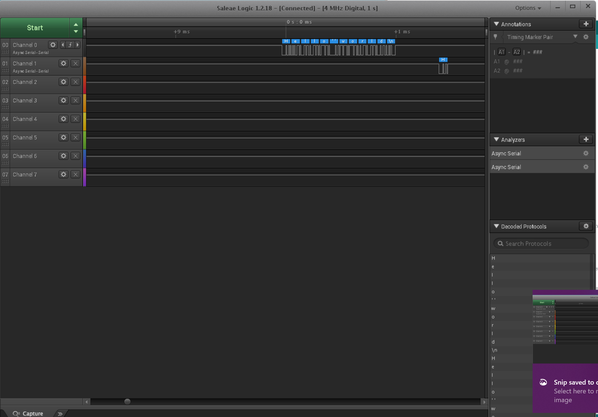

Name: Andrew Martin

EID: adm4799

Team Number:

## Questions

1. Why does your program need a setup and a loop?

	Convectionally, you need to initialize pins for the program. Setup runs through 
	the things that only need to be done once. A loop is needed to continuously update
	the microcontroller with your algorithm. 

2. What is the downside to putting all your code in a loop?

	Will make each iteration unnecessarily slower

3. Why does your code need to be compiled?

	A microcontroller does not understand java, and needs to be 
	converted to machine code of its ISA that it can understand.

4. When lowering the frequency in procedure A, step 4, what is going wrong? Brainstorm some solutions. Dimmers exist in the real world. What is their solution?

	The brain can eventually see the flicker when the frequency is lower.
	The solution would be to simply raise the frequency 

5. Why do you need to connect the logic analyzer ground to the ESP32 ground?
	So the logic analyzer is at the same base line- reads accurately 

6. What is the difference between synchronous and asynchronous communication?
	Synchronous is when data is coming at a contanst clock cycle
	asynchronous is when the data will come in at any moment.

7. Profile of UART: Sent X bytes in Y time 

    13 bytes/3.34275ms

8. Profile of SPI: Sent X bytes in Y time

    13 bytes/1.48425ms

9. Why is SPI so much faster than UART?

    SPI is Synchronous, while UART is asynchronous

10. list one pro and one con of UART

    Slower, but uses less wires

11. list one pro and one con of SPI

	faster, but uses more wires

12. list one pro and one con of I2C

    Allows for multiple masters, slower than SPI

13. Why does I2C need external resistors to work?

    Becuase the circuitry is open drain; can't source it's own current- resistors are
	used to drive current

## Screenshots

Procedure A, step 1:

Procedure A, step 4:

Procedure B, UART:

Procedure B, SPI:

